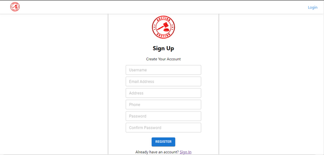
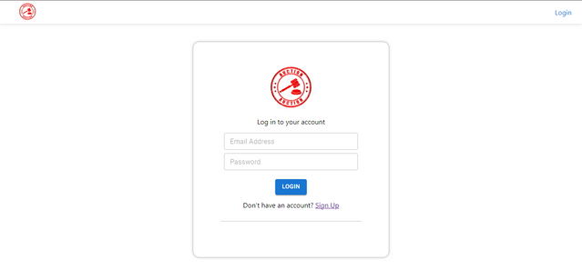
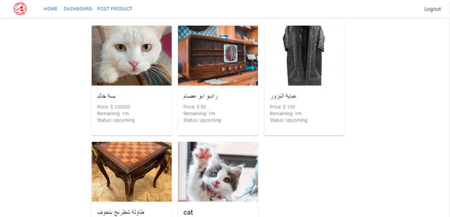
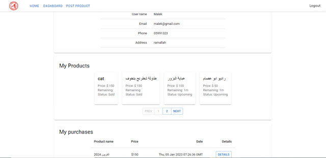
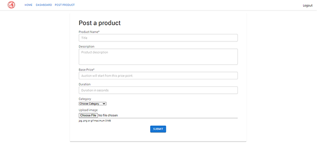
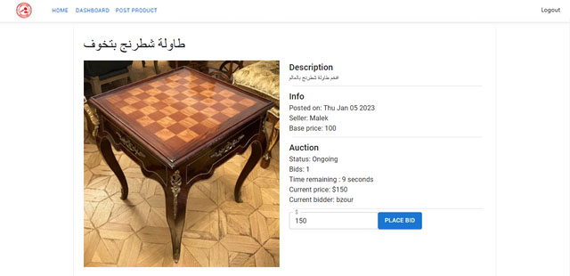

  <h1> Mazad </h1>

## Project idea:
The main idea behind the application is to provide a platform where people can sell their unwanted properties by offering them for bidding.  

## Features:
* Login and registration. In order to sell or buy a product, users have to register and login first.
* Home page that shows all products available for bidding.
* A user can add a product that he/she wants to sell with all details and upload an image of the product and after submitting, the product will move to the home page and will be visible to other users.
* When the owner of the product starts the auction, other users can start bidding on that product.
* When the time of auction that the owner provided ends, the product will be sold to the last person with the highest bid and will be removed from the home page.

## Register Page:

## Login Page:

## Home Page:

## Dashboard:

## Add Product:

## Product Details/Bidding Room:

## Technologies Used:
- Node.js
- Express
- ReactJS
- MongoDB
- Socket.io
- AWS

## Members:
- [Mutasem siam](https://github.com/mutasemsiam)
- [Malek Mohanna](https://github.com/MalekMohanna)
- [Mohammad Bzour](https://github.com/mbzour99)
- [Ahmad Shalash](https://github.com/ifcodey)

